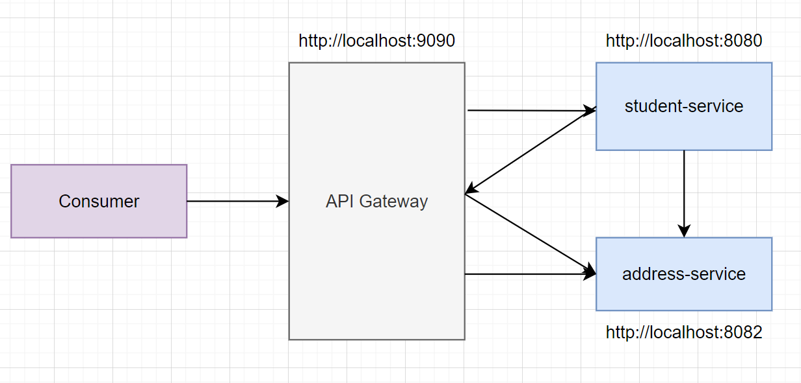

# Microservices Project

This project demonstrates a microservices architecture implemented using **Spring Boot**, **Spring Cloud**, **Hibernate**, **MySQL**, **Docker**, and **Kubernetes**. It contains four main microservices, each deployed in its container, with centralized service discovery using **Eureka** and API routing through **API Gateway**.

## Table of Contents
1. [Technologies Used](#technologies-used)
2. [Microservices Architecture](#microservices-architecture)
3. [Setup and Deployment](#setup-and-deployment)
    - [Docker Setup](#docker-setup)
    - [Kubernetes Setup](#kubernetes-setup)
4. [Endpoints](#endpoints)
5. [Diagram](#diagram)

---

## Technologies Used
- **Spring Boot**: Backend framework for building microservices.
- **Spring Cloud**: For managing inter-service communication and discovery.
- **Hibernate**: ORM for database access.
- **MySQL**: Relational database used to store service data.
- **Docker**: Containerization of services.
- **Kubernetes**: Orchestration of microservices, ensuring high availability and scalability.

---

## Microservices Architecture
The project consists of four primary microservices:
1. **Eureka Service**: Centralized service discovery (Spring Cloud Netflix Eureka).
2. **API Gateway**: Routing gateway for requests (Spring Cloud Gateway) and load balancing.
3. **Address Service**: A service managing address-related data.
4. **Student Service**: A service managing student data and communicates with the **Address Service** to retrieve address information using Circuit Breaker and OpenFeign REST Client.

---

## Setup and Deployment

### Docker Setup
1. Build Docker images for all services:
   ```bash
   docker-compose build
2. Run the containers:
   ```bash
   docker-compose up
   
### Kubernetes Setup
1. Apply the Kubernetes deployment files for all services and MySQL:
   ```bash
   kubectl apply -f eureka-service-deployment.yaml -f eureka-service-service.yaml
   kubectl apply -f api-gateway-deployment.yaml -f api-gateway-service.yaml
   kubectl apply -f address-service-deployment.yaml -f adress-service-service.yaml
   kubectl apply -f student-service-deployment.yaml -f student-service-service.yaml
   kubectl apply -f mysql-deployment.yaml -f mysql-service.yaml
2. Check the status of the deployments:
   ```bash
   kubectl get deployments
   kubectl get pods

---

## Endpoints

### Address Service
- `POST /api/address/create`: Create a new address.
- `GET /api/address/{id}`: Get address by ID.

### Student Service
- `GET /api/student/{id}`: Get student by ID, including address details fetched from the **Address Service**.

### API Gateway (routes to the above services):
- **Address Service**:
   - `http://<api-gateway-host>:<port>/address-service/api/address/create`: Create a new address through API Gateway.
   - `http://<api-gateway-host>:<port>/address-service/api/address/{id}`: Get address by ID through API Gateway.

- **Student Service**:
   - `http://<api-gateway-host>:<port>/student-service/api/student/{id}`: Get student by ID, including the address details.


---


## Diagram
Below is a diagram illustrating the architecture and communication flow between the services:

